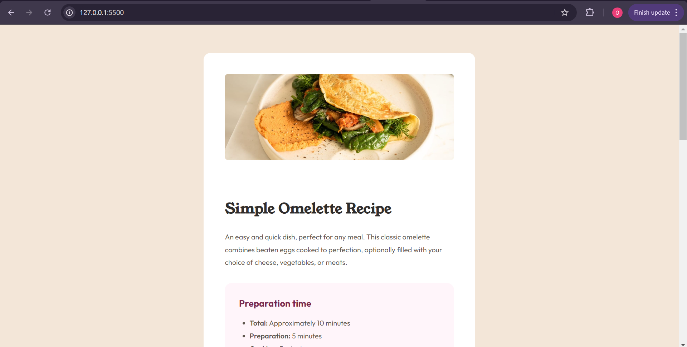

# Frontend Mentor - Recipe page solution

This is a solution to the [Recipe page challenge on Frontend Mentor](https://www.frontendmentor.io/challenges/recipe-page-KiTsR8QQKm). Frontend Mentor challenges help you improve your coding skills by building realistic projects. 

## Table of contents

- [Overview](#overview)
  - [Screenshot](#screenshot)
  - [Links](#links)
  - [Built with](#built-with)
  - [What I learned](#what-i-learned)

- [Author](#author)

## Overview

### Screenshot

### Links

- Solution URL: [https://www.frontendmentor.io/solutions/responsive-recipe-page-solution-using-css-pYmjkoZ_eN](https://www.frontendmentor.io/solutions/responsive-recipe-page-solution-using-css-pYmjkoZ_eN)
- Live Site URL: [https://frontendmentor-recipe-page-ojara.netlify.app/](https://frontendmentor-recipe-page-ojara.netlify.app/)

### Built with

- Semantic HTML5 markup
- CSS custom properties
- Flexbox

### What I learned

Brushed up my knowledge of CSS

## Author

<!-- - Website - [Add your name here](https://www.your-site.com) -->
- Frontend Mentor - [@ojaraa](https://www.frontendmentor.io/profile/ojaraa)
- Twitter - [@ojarraa](https://www.twitter.com/ojarraa)

